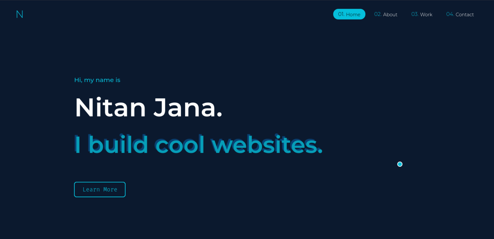
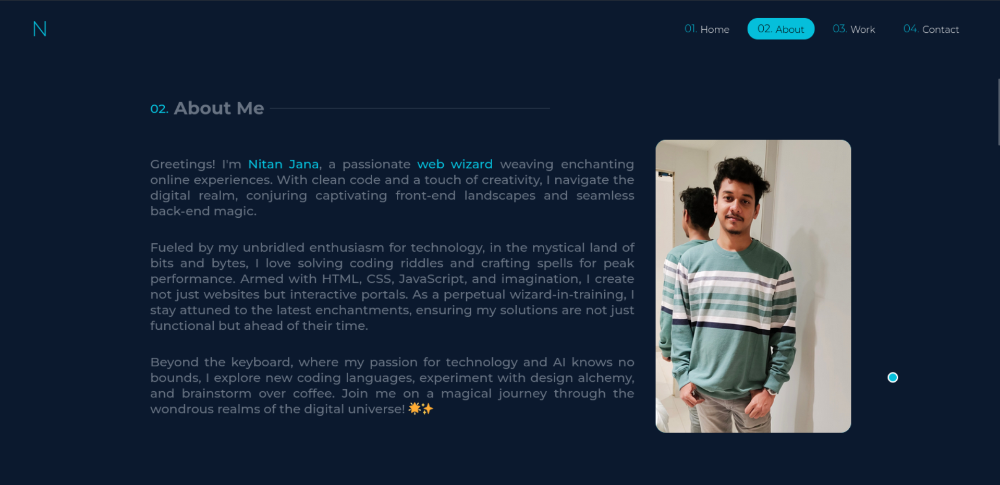
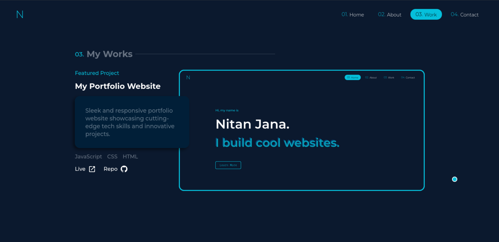
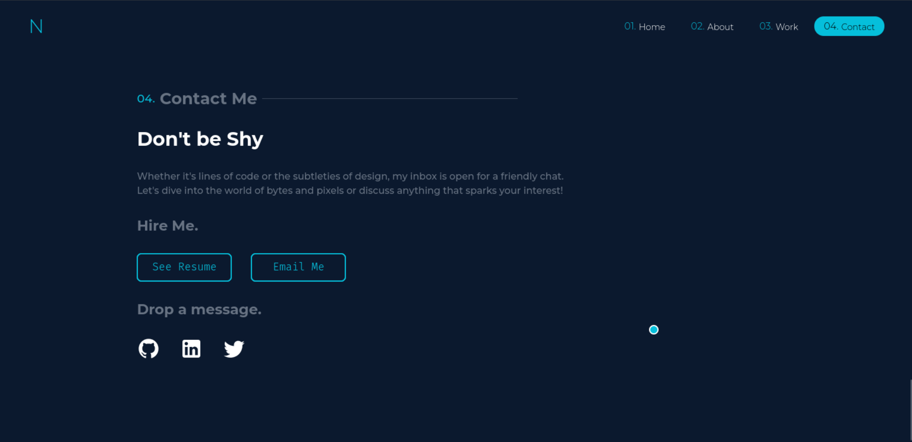

## Portfolio Website

This repository contains the source code for my personal portfolio website.






**Features:**

- Responsive design
- Clean and modern UI
- projects section, about me section, contact information, social media links

**Live Demo:**

- You can view the live demo of the website here: [portfolio](https://nitanjana.github.io/portfolio/)

**Tech Stack:**

- HTML
- CSS
- JavaScript

**Getting Started:**

1. Clone the repository:

   ```bash
   git clone https://github.com/nitanjana/portfolio.git
   ```

2. Navigate to the project directory:

   ```bash
   cd portfolio
   ```

3. Install dependencies:

   ```bash
   npm install
   ```

4. Run the application:

   ```bash
   npm start
   ```

5. Open website:

   go to [http://localhost:8080/](http://localhost:8080/)

## Usage

1. Open your web browser.
2. Navigate to [https://nitanjana.github.io/portfolio/](https://nitanjana.github.io/portfolio/).
3. Explore the current weather and forecasts for your location.

## Contributing

Contributions are welcome! Please follow these guidelines:

1. Fork the repository.
2. Create a new branch for your feature or bug fix.
3. Make your changes and submit a pull request.

## Deployment

To deploy this project to GitHub Pages:

1. Build the project:

   ```bash
   npm run build
   ```

2. Deploy to GitHub Pages:

   ```bash
   npm run gh-deploy
   ```

My portfolio is now live at [https://nitanjana.github.io/portfolio/](https://nitanjana.github.io/portfolio/).

## License

This project is licensed under the MIT License - see the [LICENSE](LICENSE) file for details.
